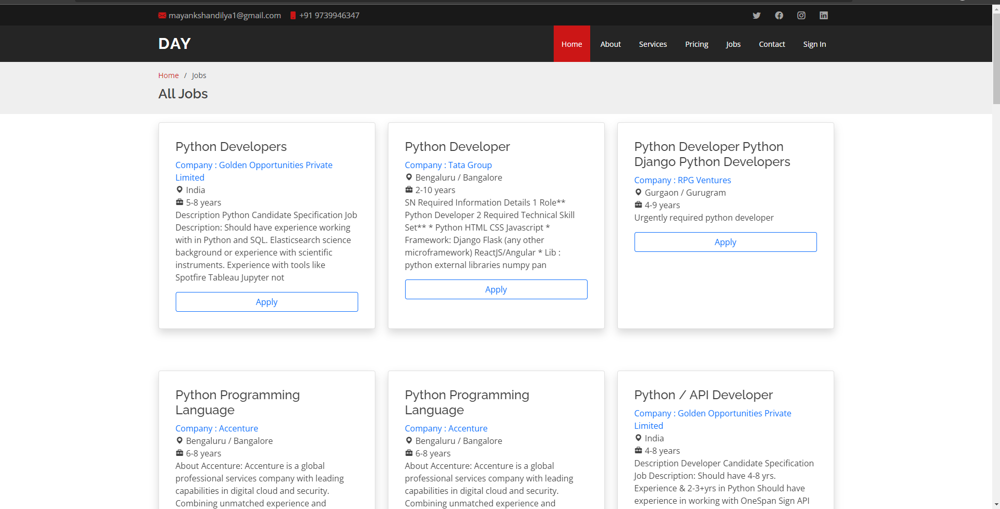

# Job-Scrapping site
A job portal website that scrapes the data from monster.com and presents it.

 

## Work-flow
The scrapper written in python scraps the data from monster.com and generates a CSV file. This CSV is then uploaded to the phpmyadmin panel and converted to a table of jobs.
The PHP code then allows us to fetch the contents from the server and display the scrapped results.
